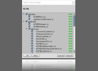

# マークダウンの書式例

# 見出し1
## 見出し2
### 見出し3

## 書式
**太字** **Bold**

*斜体* *Italic*

~~打消し線~~ ~~Strikethrough~~

## コードブロック
これは`code block within a line`です。

```cs
// 独立したコードブロック
string a = "これはC#(cs)書式の独立したコードブロックです。";
```

## リンク
[unityroom たなかゆうページ](https://unityroom.com/users/81feabmrtpxcuv0h5dlg)

## 画像


画像はこのフォルダー内に含めて相対リンクで示す。

マークダウン内にはimgタグが使える。画像のサイズ指定をしたい場合はimgタグを使う


## 箇条書き
### 通常リスト
- 箇条書き
- 箇条書き2
- 箇条書き3

### 通し番号付きリスト
1. 通し番号1
1. 通し番号2
1. 通し番号3

### 途中から番号を始める
100. 好きな値から
100. 始められる

### 字下げ
- 箇条書き
  - 箇条書き
    - 箇条書き

## タスクリスト
- [ ] タスク1
- [ ] タスク2
- [x] 完了

## 段落
1行だけの改行は
効果がない。

改行するには

空行を１行入れる。

## セパレーター
ハイフン(`-`)やアスタリスク(`*`)を3つ以上でセパレーター。

---

***

## 補足(Footnotes)
補足[^1]の表記。wiki[^2]などで見るやつ。

[^1]: 文末に補足を追加できる
[^2]: https://ja.wikipedia.org/

## 表
|表の|書式|
|:-:|:-|
|これを|知っていると|
|表現の幅が広がって|便利。|
