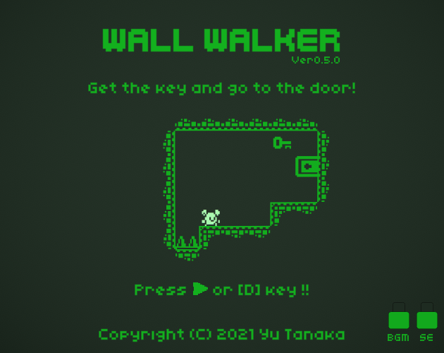
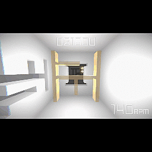
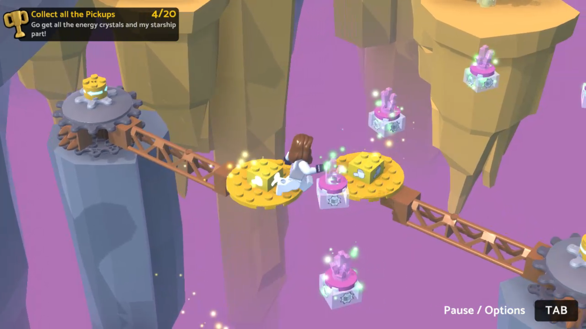

**補足：具体例として講師の実際の情報を掲載している項目もありますが、飽くまでサンプルなので実際の保有資格や経歴を掲載したものでありません。**

---

# Portfolio

- デジタルアーツ太郎
- 連絡先 Twitter [@am1tanaka](https://twitter.com/am1tanaka) / Email [tnk.dat.class@gmail.com](mailto:tnk.dat.class@gmail.com)
- 専門学校デジタルアーツ東京 ゲームプログラマーコース 202x年卒業予定

## 資格
- ITパスポート試験合格
- 基本情報処理技術者試験合格

## スキル
- C#
  - 利用歴〇年
  - Visual Studioで独自のツールの作成が可能
- Unity
  - 利用歴〇年
  - オリジナルの個人/チーム作品の開発経験あり
- C/C++
  - 利用歴〇年
  - コンソールで簡単なデータ処理プログラムを開発
- cluster
  - 利用歴1年
  - ワールド、ギミックの作成

## 取り組んでいるテーマ
- オブジェクト指向のポリモーフィズムの活用
- プラットフォーマーゲームの多様性のあるプレイヤー制御

## 作品リスト

### Wall Walker

[Wall Walker](https://am1tanaka.itch.io/wall-walker)

壁に向かって歩くと部屋が回転する。箱に押しつぶされたりトゲにぶつからないように鍵を手に入れてゴールを目指すパズルゲーム。

- 開発環境：Unity
- 開発期間：2日
- [Kenney Jam 2021](https://itch.io/jam/kenney-jam-2021)参加作品
  - [5位](https://itch.io/jam/kenney-jam-2021/results)

### 正箱

[正箱-ShoBako-](https://unityroom.com/games/shobako)

「正」の字を左右に回転させて、迫ってくる部屋の壁の隙間を潜り抜けるアクションゲームです。

- 開発環境：Unity
- 開発期間：2週間半
- 1週間ゲームジャム「正」参加作品
  - 最高順位　総合40位 / サウンド21位 / 操作性18位

### 溶岩洞窟 de ジャンプ！

[溶岩洞窟 de ジャンプ！](https://cluster.mu/w/78551223-2a8d-4700-a409-128e628439d5)

動く床を上手にジャンプで渡って行って、洞窟の頂上を目指すclusterワールド。

- 開発環境：cluster
- 開発期間：2日
- [Cluster GAME JAM 2021 in SUMMER](https://www.contest.cluster.mu/gamejam2021summer-home)参加作品
  - [ビジュアル部門賞](https://cluster.mu/sections/GAMEJAM2021SUMMER_VISUAL)

### GET THE SHIP BACK!

[Get The Ship Back!](https://play.unity.com/mg/lego/builds-ln-1)

- 開発環境：Unity + LEGO Microgame
- 開発期間：3週間
- LEGO Microgame My First Game Jam 参加作品

## 連絡先
- ブログ [tanaka's Programming Memo](https://am1tanaka.hatenablog.com/)
- Twitter [@am1tanaka](https://twitter.com/am1tanaka)
- E-mail [tnk.dat.class@gmail.com](mailto:tnk.dat.class@gmail.com)
